# Intune-Policies

### SCEPman Root Zertifikat deployment

Als aller erstes muss man zum SCEPman Portal und dort das Root-Zertifikat herunterladen welche ich bei der SCEPman Einrichtung erstellt habe

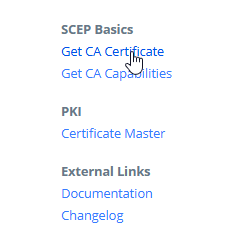

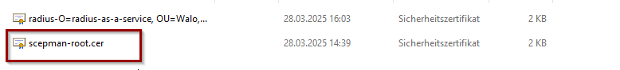

Nachdem ich das Root Zertifikat vom SCEPman lokal bei mir heruntergeladen habe muss ich diese nun auch an alle Clients verteilen.
Das verteilen der Zertifikate mache ich über die Intune Policies.

Da es bei uns nur um Windowsgeräte handelt gehe ich um Intune unter **"Geräte > Windows > Konfiguration"** und erstelle dort die Richtlinie

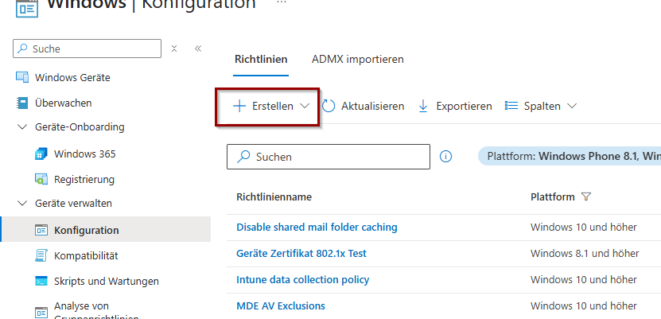

Als Plattform wähle ich Windows 10 und Höher und den Profiltyp als **"Vorlage > Vertrauenswürdiges-Zertifikat"**

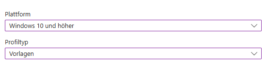

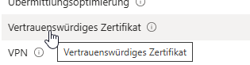

Als nächstes muss ich die Zuweisung definieren.
Da habe ich bereits im Voraus eine Gruppe Namens **"802.1X Test"** erstellt in welchem sich nur mein Test-Gerät befindet.

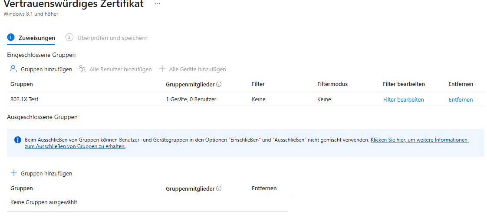

Nun zum Schluss muss man angeben welches Zertifikat verteilt werden sollte und wo es beim Client Gespeichert werden soll.

Da es sich um ein Root-Cer handelt macht es im Zertifikatsspeicher vom Laptop direkt als Stammzertifikat abzuspeichern.

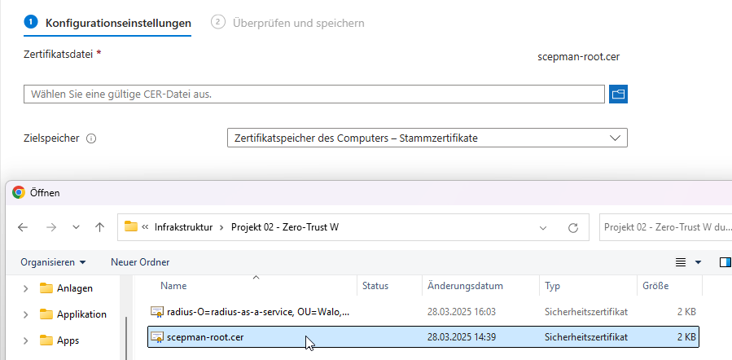

Nachdem ausstarten des Test-Laptops sollte das Root-Zertifikat verteilt worden sein.

Wie man auf dem Bild sehen kann ist das der Fall

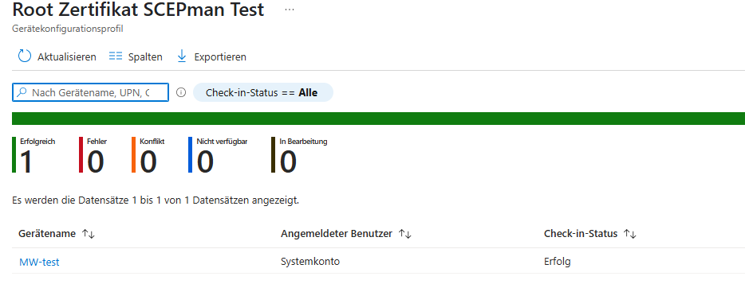

### RadiuSaaS Root Zertifikat deployment

Genau die gleichen Schritten wie oben beim SCEPman Rootzertifikat beschrieben.

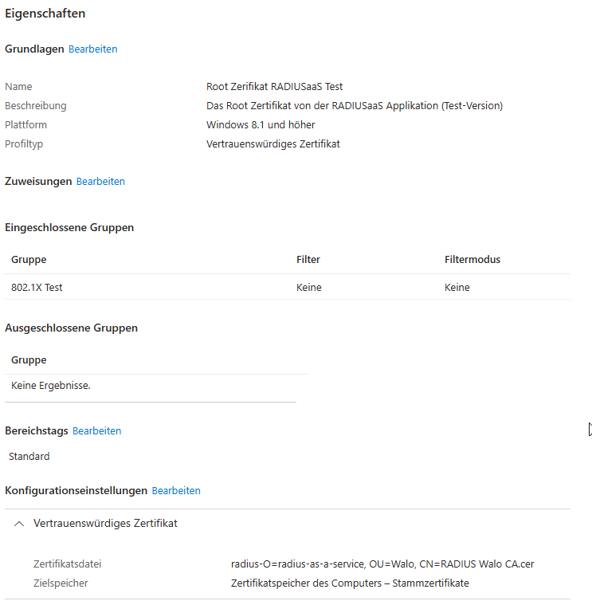

Die Verteilung hat hier ebenfalls funktioniert

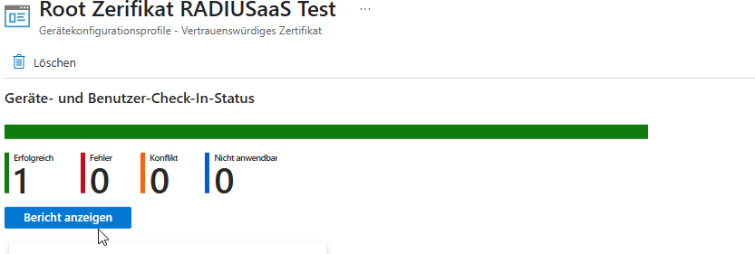

### SCEPman Client Zertifikat deployment

Für das austellen der Client Zertifikate gehe ich gleich vor wie oben.
Jedoch statt das ich den Profiltyp als Vertrauenswürdiges Zertifikat angebe,  definiere ich es als SCEP-Zertifikat 

Anschliessend gebe ich an was es konkret für ein Zertifikat ist.
In meinem Fall handelt es sich um ein Geräte-Zertifikat.

Des weiteren gebe ich den Antragsstellernamen an welchen ich einfach als Geräte-ID Definiert habe was es am einfachsten macht die Geräte zu filtern.

Als nächstest muss ich angeben wie lange das Zertifikat gültig sein sollte.
Laut aktuellen Vorgaben darf es **398 Tage** Gültig sein.

Somit habe ich in meinem Fall einfachkeisthalber es auf ein Jahr beschränkt.
Den Erneuerungschwellenwer welcher bestimmt wann man vor dem Ende der Gültigkeitsdauer des Zertifikats ein neues Zertifikat anfordern kann. (den wert in % angeben)

Um sicher zu gehen das alles rechtzeitig vorgenommen wird habe ich 25% angegeben.
Also 3 Monate vor Adem Ablauf. 

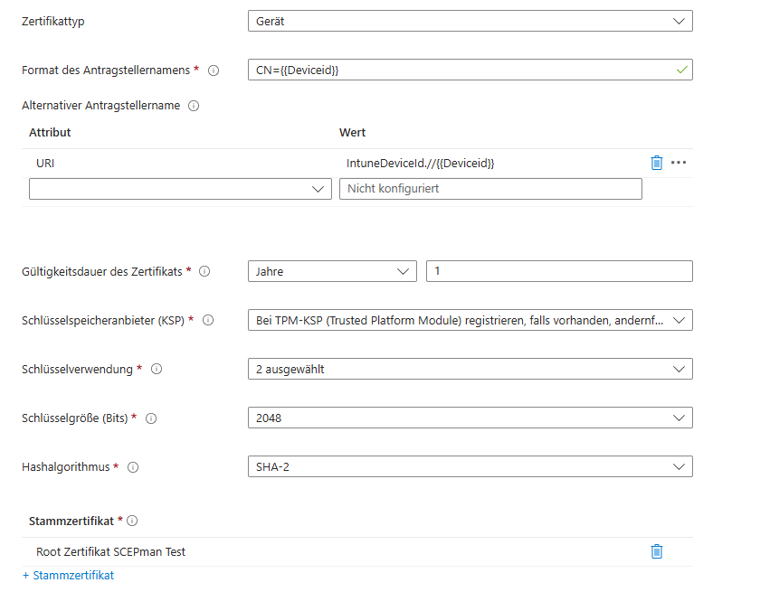

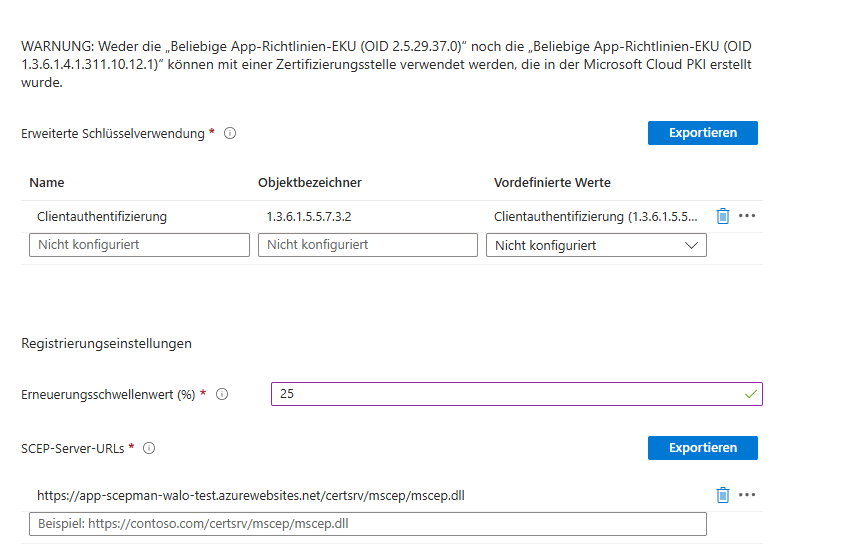

### WiFi Profil Zerttifikat deployment

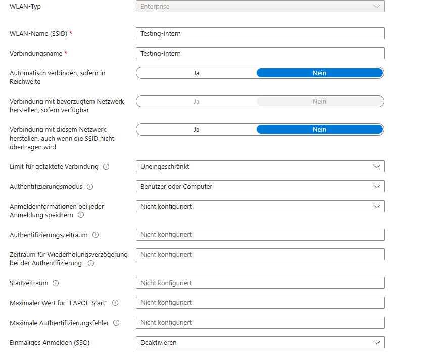

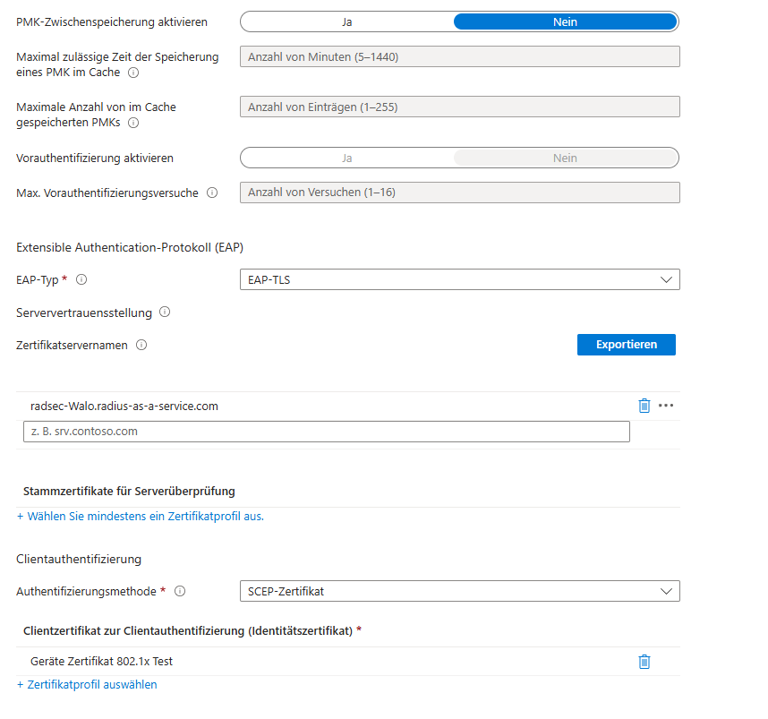

