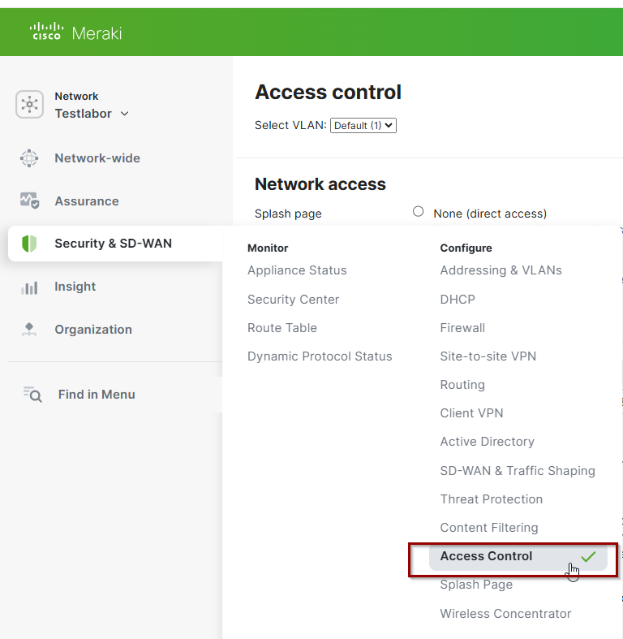
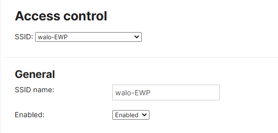
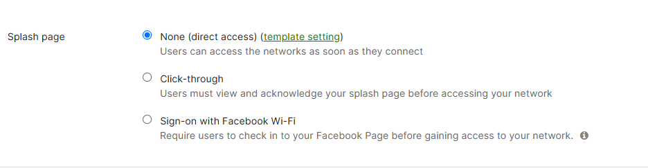
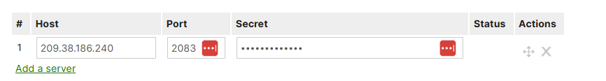

# Meraki-Radius-Config

## Access Control konfigurieren

Damit der Zugang zu den AP und Switches nur erlaubt wird wenn der RADIUS-Server es zulässt müssen wir den Access Control über Radius konfigurieren

Egal ob AP oder Switch, wir müssen unter Acess Control den Network Access angeben

Anschliessend müssen wir dort erstmal die SSID angeben wo sich unsere Clients dann anmelden sollte.

Als nächstes muss man angeben ob es eine Splash Page braucht
Da es für uns nicht relevant ist habe ich angegeben das es keine braucht und man sich direkt verbinden kann

und zu schluss kann man nun den RADIUS-Server angeben.
Da dieser AP RadSec unterstützt habe ich es über den Port 2083 konfiguriert

---

## PRTG Überwachung