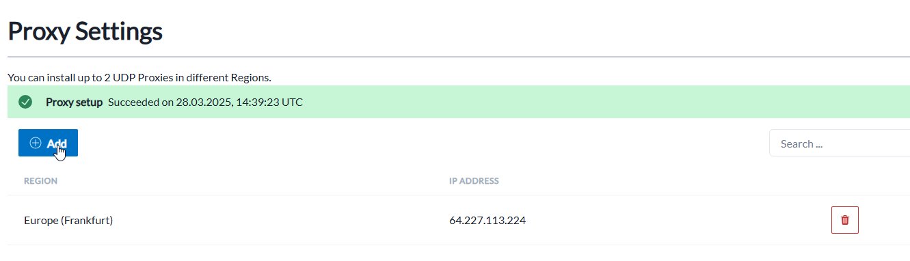
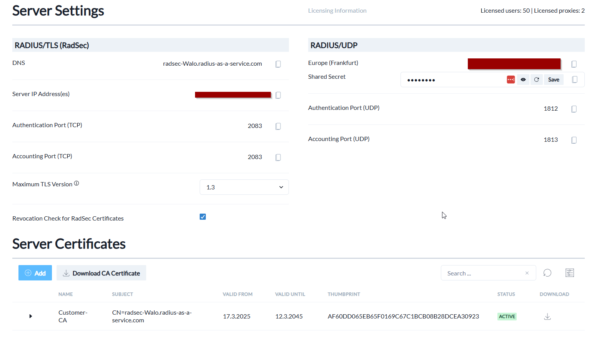

# RadiuSaaS Einrichtung

## SCEPman as Trusted-Issuer

Als ersten Schritt muss man SCEPman als vertrauenswürdigen Certficate Issuer definieren. Dafür kann man entweder die URL zur SCEPman Instanz hinzufügen oder das Root-Zertifikat als PEM File.

Ich habe mich entschieden einfach die URL hinzuzufügen

---

## Proxy für RADIUS

Da nicht alle unsere Switches und AP sich über das RadSec Protokol Autentifizieren kann müssen wir auch das RADIUS Protokol zulassen.

Dafür müssen wir einen Proxy erstellen welcher RADIUS UDP Traffic erlaubt.
Ich habe den Proxy in Frankfurt erstellt für die Konnektivität.

Nach Paar Minuten müssten alle Services Verfügbar sein

## RADIUSaaS MDM Deployment

[Siehe folgendes](https://gitlab.com/semester_21/Modul-300/-/blob/main/Cloud-%20PKI%20+%20Authentification/Intune-Policies.md?ref_type=heads)

## RADIUS/RadSec Authentification einrichten für Netzwerkgeräte

[Siehe Folgendes](https://gitlab.com/semester_21/Modul-300/-/blob/main/Cloud-%20PKI%20+%20Authentification/Meraki-Radius-config.md?ref_type=heads)