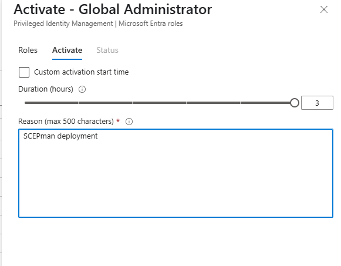
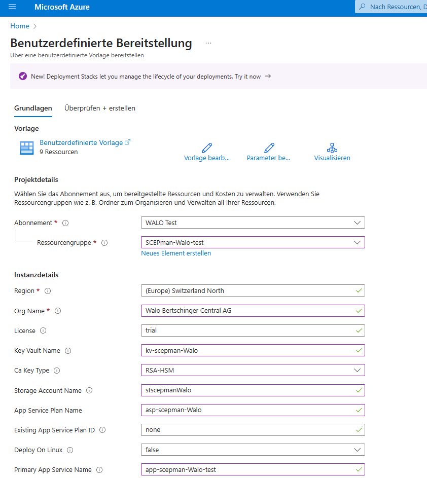
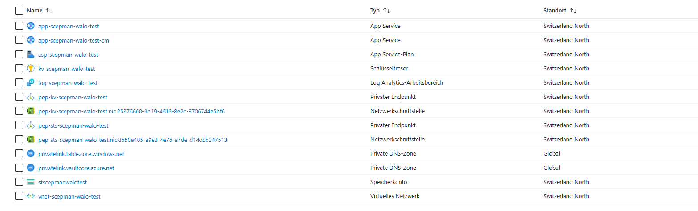
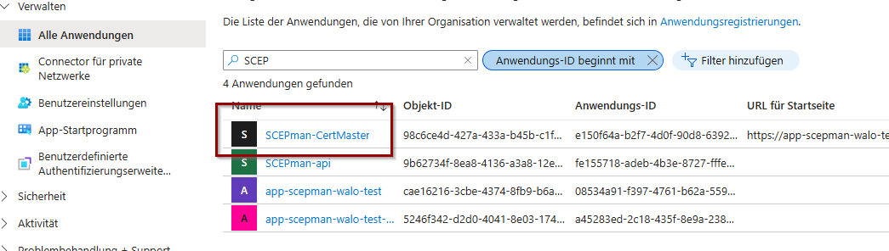
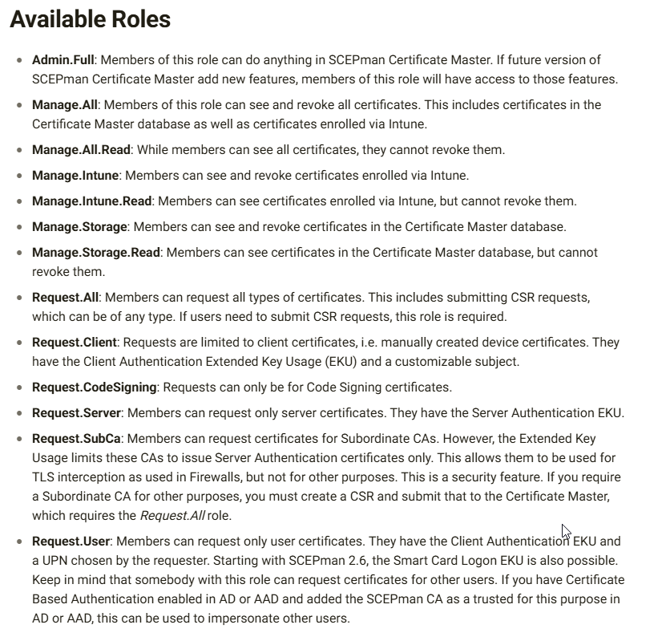
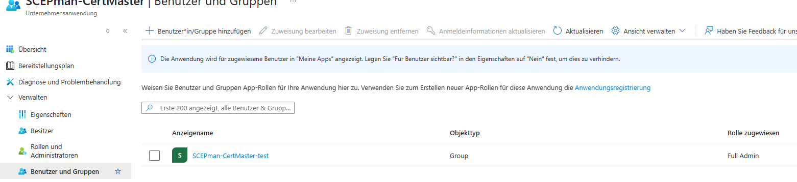
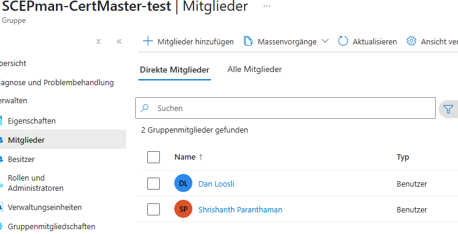
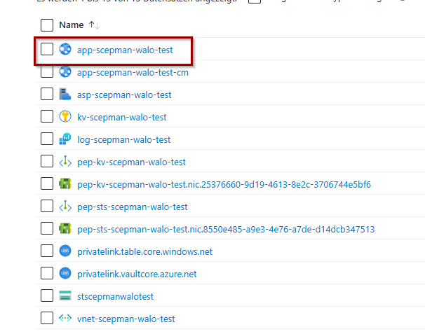
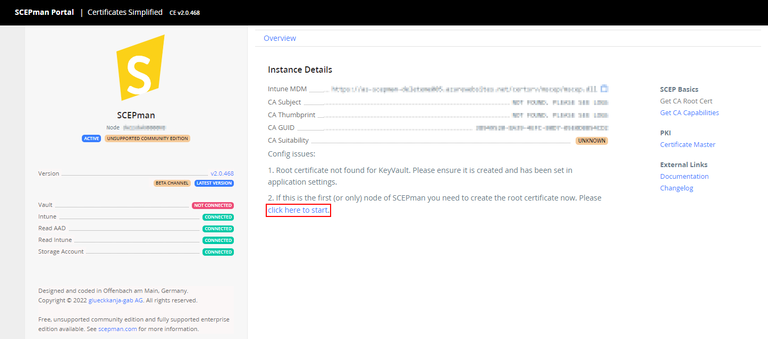
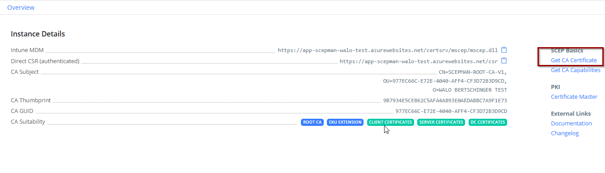

## SCEPMan Einrichtung

### Azure Deployment + Terraform

Bevor ich SCEPman im Azure deployen kann muss ich mir Global Admin rechte zuweisen.

Anschliessend kann ich entweder direkt SCEPMan deployen oder durch Terraform. Ich habe mich entschieden beides zu dokumentieren.

**Terraform:**

**Direkt über Azure**:

Da ich die ganze Applikationen wie SCEPman und später auch RadiuSaaS etc. einheitlich bei mir haben möchte und später eventuell es mit einer Monitoring Applikation überwachen möchte habe ich eine neue Ressourcengruppe erstellt mit dem Namen "SCEPman-Walo-test"

Nachdem Deployen wird man zu seiner Ressourcen Gruppe weitergeleitet welche einem einen Überblick von allen verwendeten/genutzen Ressourcen gibt:

---

### Permission Assignments

Da SCEPman nach dem deployen nicht die Berechtigung hat mit dem Entra Directory und Intune Endpoint zu interagieren. Deswegen muss man ein Powershell Skript übers Azure ZLI ausführen um diese Berechtigungen zuzuteilen.

Hier befindet sich das [Skript]()

Das Azure CLI ist im Azure Cloud Shell bereits vorinstalliert also führe ich das Skript direkt in der Azure Cloud Shell aus.

### SCEPman Certificate Master Konfiguration

Da wir SCEPman nicht nur für die Client Zertifikate bezüglich dem NAC einrichten möchten sondern auch für die Zertifikatausstellung bezüglich Webservern müssen wir den Certificate Master Konfigurieren. 
Dieser hat die Funktion Webserver Zertifikate auszustellen.

Um diese zu Requesten müssen wir unter "**Unternehmensanwendungen**" > "**Alle Anwendungen**" nach den Certificate Master suchen und dort dann die User und oder Gruppen hinzufügen welche die Berechtigung haben sollten diese Request durchzuführen. 

Hier noch ein Überblick von den möglichen Rollen:

Ich habe folgende Gruppe hinzugefügt mit der Rolle Full Admin.
In der Gruppe bin jedoch nur ich und mein Abteilungsleiter drin

Somit habe ich nun Adminrechte um alle Arten von Zertifikate zu requesten, revoken etc.

---

### SCEPman Root Zertifikat erstellen

Damit wir SCEPman als vertrauenswürdigen CA definieren können müssen wir das Root Zertifikat an die ganzen Clients verteilen. Dafür muss aber erstmal ein Root-Zertifikat erstellt werdem

Daüfr muss man zu der Ressourcen Gruppe und den SCEPman App-Service aufrufen.

dort gibt es dann die Option das Root zu erstellen.

Nachdme erstellen muss man eventuell noch ein wenig warten.
Anschliuessend kann man die Website refreshen.

Nun sollte man oben rechts sehen das man das Zertifikat vom CA installieren kann

---

### Application Insight einrichten (optional)

---

### Heath-Check und Alarm-System (optional)

---

### Auto-Scaling (optional)

---

### Geo-Redundancy (optional)

---

### MDM Profil Deployment

Siehe [Intune-Policies]()