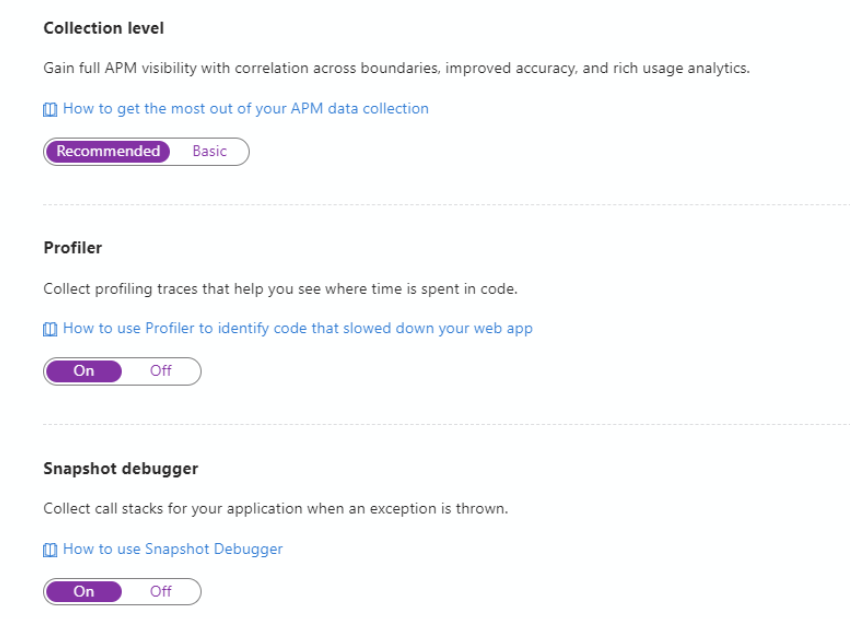
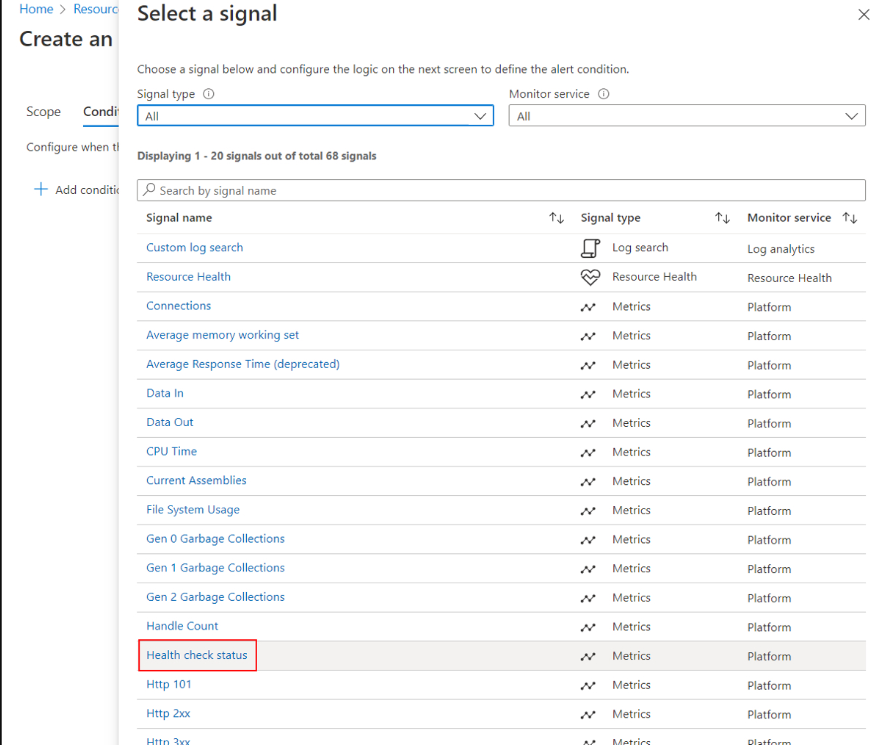

## SCEPMan Einrichtung

### Azure Deployment + Terraform

Bevor ich SCEPman im Azure deployen kann muss ich mir Global Admin rechte zuweisen.

Anschliessend kann ich entweder direkt SCEPMan deployen oder durch Terraform. Ich habe mich entschieden beides zu dokumentieren.

**Terraform:**

**Direkt über Azure**:

Da ich die ganze Applikationen wie SCEPman und später auch RadiuSaaS etc. einheitlich bei mir haben möchte und später eventuell es mit einer Monitoring Applikation überwachen möchte habe ich eine neue Ressourcengruppe erstellt mit dem Namen "SCEPman-Walo-test"

Nachdem Deployen wird man zu seiner Ressourcen Gruppe weitergeleitet welche einem einen Überblick von allen verwendeten/genutzen Ressourcen gibt:

---

### Permission Assignments

Da SCEPman nach dem deployen nicht die Berechtigung hat mit dem Entra Directory und Intune Endpoint zu interagieren. Deswegen muss man ein Powershell Skript übers Azure ZLI ausführen um diese Berechtigungen zuzuteilen.

Hier befindet sich das [Skript]()

Das Azure CLI ist im Azure Cloud Shell bereits vorinstalliert also führe ich das Skript direkt in der Azure Cloud Shell aus.

### SCEPman Certificate Master Konfiguration

Da wir SCEPman nicht nur für die Client Zertifikate bezüglich dem NAC einrichten möchten sondern auch für die Zertifikatausstellung bezüglich Webservern müssen wir den Certificate Master Konfigurieren. 
Dieser hat die Funktion Webserver Zertifikate auszustellen.

Um diese zu Requesten müssen wir unter "**Unternehmensanwendungen**" > "**Alle Anwendungen**" nach den Certificate Master suchen und dort dann die User und oder Gruppen hinzufügen welche die Berechtigung haben sollten diese Request durchzuführen. 

Hier noch ein Überblick von den möglichen Rollen:

Ich habe folgende Gruppe hinzugefügt mit der Rolle Full Admin.
In der Gruppe bin jedoch nur ich und mein Abteilungsleiter drin

Somit habe ich nun Adminrechte um alle Arten von Zertifikate zu requesten, revoken etc.

---

### SCEPman Root Zertifikat erstellen

Damit wir SCEPman als vertrauenswürdigen CA definieren können müssen wir das Root Zertifikat an die ganzen Clients verteilen. Dafür muss aber erstmal ein Root-Zertifikat erstellt werdem

Daüfr muss man zu der Ressourcen Gruppe und den SCEPman App-Service aufrufen.

dort gibt es dann die Option das Root zu erstellen.

Nachdme erstellen muss man eventuell noch ein wenig warten.
Anschliuessend kann man die Website refreshen.

Nun sollte man oben rechts sehen das man das Zertifikat vom CA installieren kann

---

### Application Insight einrichten 

Um einen Überblick vom Traffic und allem zu haben habe ich noch zusätzlich einen Application Insight eingerichtet welcher den Traffic und die Server Verfügbarkeit zeigt, Dies erlaunbt es mir besser Trouble-Shooting zu betreiben

---

### Heath-Check und Alarm-System (optional)

Um die Verfügbarkeit zu gewährleisten ist es auch sehr wichtig einen Health-Check und ein Alarm System einzurichten damit wir möglichst früh mitbekommen falls SCEPman down wäre

Als erstes muss man unter Health Check denn Pfad zum probe eingeben. DIeser wäre einfach **"/probe**"

Somit ist der Health-Check eingerichtet

Nun müssen wir auch noch ein Alarm-System einrichtet welches uns effektiv informiert falls der Health-Check fehlschlägt.

Dafür geht man zu den Alerts und klickt auf create alert.
Anschliessend kann man direkt auch die das Signal angeben was in unserem Fall der Health-Check wäre

Ich habe es folgendermassen konfiguriert:
Und zu schluss muss man noch eine Action-Group auswählen und das Alarm-System erstellen

So würde es aussehen:

---

### Auto-Scaling (optional)

---

### Geo-Redundancy

Da Geo-Redundancy in unserem Use-Case nicht relevant ist werde ich es nicht einrichtet aber zeigen wie es gehen würde.

So sehe die Ziel-Architektur aus:

Um es umzusetzen ist sehr einfach falls man SCEPman als CaaS eingerichtet hat. WIe ich mit Terraform

Man muss die komplette Einrichtung von SCEPman nochmals machen aber statt das es in der Schweiz gehostet wird muss man einen neuen Geo-Standort auswählen (z.B West-Europe)

Somit muss ich nur das Skript mit einem neuen Standort anpassen
Alternativ kann man es auch über folgendes CMDLET clonen:

*****New-SCEPmanClone -SourceAppServiceName <Your SCEPman App Service Name> -TargetAppServiceName <Your cloned App Service Name> -TargetAppServicePlan <Your second App Service Plan in the second Geo Location> -SearchAllSubscriptions 6>&1*****

Über das CMDLET wird alles automatisiert und man muss nichts mehr zusätzlich einrichten.

Falls man will kann man noch den Traffic auf beide SCEP-man Applikationen balancieren um den Traffic zu minimieren und optimieren

#### Traffic Manager Setup

Das geht folgendermassen:

Man geht zum **Traffic Manager profile**
und wählt seine Ressourcen-Gruppe aus und gibt all die Daten an.

**Beispiel**:

Und nun muss man es erstellen und die Konfiguration anpassen:

---

### MDM Profil Deployment

Siehe [Intune-Policies]()