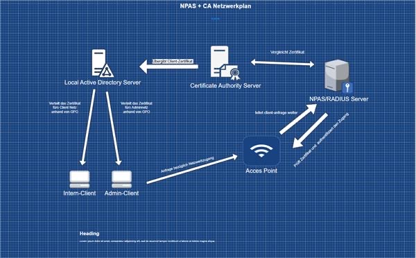
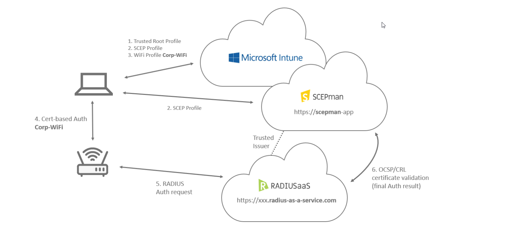

# Cloud PKI + Authentification Ziel:

## Ziel:

Das Ziel ist es eine komplette Cloud Public Key Infrastructure mit einer cloudbasiertem Certificate Authority zu deployen und für den NAC noch zusätzlich einen Cloud Radius Server einrichten. (In diesem Fall für eine SaaS-Lösung entschieden) 
Das Hauptziel dieser zwei Services ist es diese zu kombinieren für das implementieren des IEEE 802.1X Standarts im Netzwerk. **(NAC)**

Die Cloud PKI bzw. der Cloud CA dient dazu Zertifikate Auszustellen und der Cloud Authentificator diese Zertifikate zu prüfen und je nach Zertifikat automatisch in das jeweilige Netzwerk zuzuweisen.

Diese Lösung kann man mit diversen Lösungen wie Clearpass, Cisco Identity Service Engine etc. umgesetzt werden.

Da es aber in diesem Modul geht diverse Services/Dienste zu kombinieren um daraus eine Lösung/Applikation zu erstellen habe ich mich entschieden SCEPMAN (Cloud CA) und RADIUSaaS (Cloud Radius Server) zu verwenden.

---

## Wahl des Projekts

Es hat konkret 2 Gründe Warum ich mich für das Projekt entschieden habe.

### Betriebs-Projekt

Der erste Grund ist das ich bereits vom Betrieb aus den Auftrag bekommen habe mich um den NAC und die PKI Infrastruktur zu kümmern und es neu zu erstellen. Mir war es erlaubt eine komplett eigene Lösung zu suchen und zu implementieren.

### Komplexität und Anforderungen

Ein weiterer Grund war die Komplexität.
Da mein Ziel in diesem Modul ist eine Note 6 oder vergleichbares zu erlangen empfand ich das Projekt perfekt da meine Umsetzung und die Kompetenzmatrix vom Modul fast genau übereinstimmen.

---

## Was ist der IEEE 802.1X Standart

Der IEEE 802.1X Standard ist ein Netzwerkzugangskontroll-Protokoll, das Authentifizierung vor dem Netzwerkzugriff ermöglicht. Es wird vor allem in kabelgebundenen und drahtlosen Netzwerken verwendet, um sicherzustellen, dass nur autorisierte Benutzer und Geräte auf das Netzwerk zugreifen können.

802.1X basiert auf drei Hauptkomponenten:

- **Supplicant**: Das Endgerät (z. B. Laptop, Smartphone), das Zugriff auf das Netzwerk anfordert.
- **Authenticator**: Das Netzwerkgerät (z. B. Switch, WLAN-Access Point), das den Zugriff kontrolliert.
- **Authentication Server**: Meist ein RADIUS-Server, der die Authentifizierungsentscheidung trifft (z. B. durch Zertifikate, Benutzername/Passwort).

Der Authentifizierungsprozess läuft typischerweise wie folgt ab:
1. Das Endgerät sendet eine Anfrage an den Authenticator.
2. Der Authenticator leitet diese an den Authentication Server weiter.
3. Nach erfolgreicher Prüfung (z. B. per Zertifikat) wird dem Gerät der Zugriff auf das Netzwerk gewährt – oft mit einer dynamischen VLAN-Zuweisung.

802.1X ist ein zentraler Baustein für moderne, Zero-Trust-orientierte Netzwerksicherheit, da es verhindert, dass sich unbekannte oder kompromittierte Geräte unkontrolliert mit dem Netzwerk verbinden.

---

## Warum SCEPMAN + RadiuSaaS

Die Kombination aus **SCEPman** und **RADIUSaaS** bietet eine moderne, vollständig cloudbasierte Alternative zu anderen NAC-Lösungen wie ClearPass oder Cisco ISE. Diese Kombination erfüllt die Anforderungen an sichere 802.1X-Authentifizierung über Zertifikate – ohne lokale Server oder komplexe PKI-Infrastruktur.

**SCEPman** ist eine cloudbasierte Zertifizierungsstelle (Cloud CA), die vollständig in Microsoft Azure integriert ist. Sie ermöglicht die automatische Ausstellung und Verwaltung von Benutzer- und Geräte-Zertifikaten über das SCEP-Protokoll.

**RADIUSaaS** stellt einen skalierbaren Cloud-RADIUS-Dienst bereit, der die Authentifizierung anhand der von SCEPman ausgestellten Zertifikate übernimmt. So wird sichergestellt, dass nur Geräte mit gültigem Zertifikat Zugriff auf das Netzwerk erhalten.

Vorteile dieser Lösung:
- **100 % Cloud-native** – keine lokale Infrastruktur notwendig
- **Automatisierte Zertifikatsvergabe** über Intune oder andere MDM-Systeme
- **Einfache Integration mit Azure AD**
- **Hohe Skalierbarkeit und Verfügbarkeit**
- **Kosteneffizienter Betrieb**, da keine eigene PKI oder RADIUS-Server betrieben werden müssen

## Aktuelle Architektir

## Zielarchitektur

Die Zielarchitektur ist etwa wie auf dem Bild beschrieben

(Quelle: [CloudPKI](https://oliverkieselbach.com/tag/cloudpki/) )

Anders als auf dem Bild jedoch ist mein Ziel das die Authentifzierung grösstenteils über RadSec folgt statt standartmässig über RADIUS da dieses Protokoll sicherer ist

Des weiteren werden nur die Client-Zertifikate über Microsoft Intune verteilt. Da wir unsere Server nicht im Intune/Azure registriert haben werden die Serverzertifikate über die lokalen AD GPOs verteilt.

---

